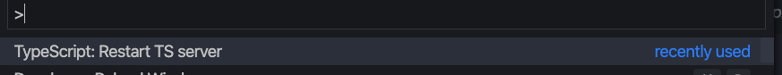

COmpiler opt ref: https://www.typescriptlang.org/docs/handbook/compiler-options.html

### relevant files:
- because of the way keg-component works. i would imagine its best to tsc compile the `/build` folder, but then again, it probably doesn't matter because we only use `.d.ts` files for intelissense reference and it doesn't/shouldn't affect performance when in use.

- tsconfig.json
  - change the `include` property to `build` if you want to tsc compile `/build` or keep both `/build` and `/src` to see which one works better
- declaration.tsconfig.json

compile: `tsc -p declaration.tsconfig.json`
note: if it throws an error after running the cmd. probably need to delete the existing `d.ts` files
Issue:
- comments are not getting compiled down to `d.ts` files, but i know for sure other libraries have it


### Testing
- the way i've been testing it out is by running the **compile** command above inside `keg-core/node_modules/keg-components` repo
- also update the `keg-core/node_modules/keg-components/package.json` for this key
    - `"types": "build/esm/kegComponents.web.d.ts"` 
    - where the **value** is wherever the entrypoint of the definition file is
- Once you modify the `package.json`, you will need to re-run the TS/JS server on vscode
  - 

- then do this on any file and see if it traces on hover or as you type
  ```
    import {AppHeader} from 'keg-components'

    <AppHeader 
      superduper
    />
  ```